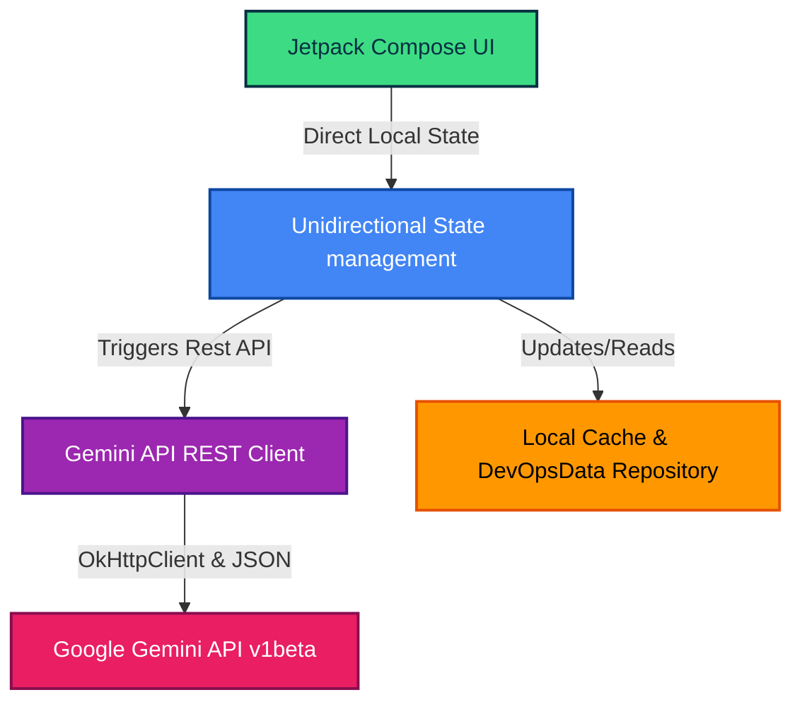

<div align="center">

</div>

# DevOpsHub AI

[](https://kotlinlang.org)
[](https://developer.android.com/jetpack/compose)
[](https://developer.android.com/studio/releases/platforms)
[](#-license)
[](#-testing-suite)

An Android DevOps assistant built with **Jetpack Compose (Material 3)**, powered by the **Gemini API**. DevOpsHub AI brings six core "pillars" of cloud infrastructure, security, and operations into a single cohesive mobile dashboard.

This application is designed with a lightweight unidirectional data flow, using native Material 3 styling, Edge-to-Edge capabilities, local mock database state machines, and direct integration with Gemini REST services for intelligent root-cause analysis suggestions, IaC draft generation, simulated cluster troubleshooting, and security remediation recommendations.

---

## 📈 Project Status

**Current Status**: `Active Development / Prototype`

This project is currently under active development. All Cloud infrastructure, CI/CD pipelines, container clusters, and metric parameters are simulated using robust, interactive local state controllers to showcase client application workflows. It is intended as a high-fidelity design prototype, experimental playground, and educational blueprint, rather than a live production integration.

---

## 📌 Table of Contents

- [💡 Why DevOpsHub AI?](#-why-devopshub-ai)
- [📈 Project Status](#-project-status)
- [📥 Download](#-download)
- [📱 Screenshots](#-screenshots)
- [🎬 Interaction Flow (Walkthrough)](#-interaction-flow-walkthrough)
- [🚀 Key Features (The 6 Pillars)](#-key-features-the-6-pillars)
- [🛠️ Tech Stack & Real Architecture](#️-tech-stack--real-architecture)
- [🔑 Setup & API Key Configuration](#-setup--api-key-configuration)
- [📦 Project Structure](#-project-structure)
- [⚙️ Build & Run Locally](#️-build--run-locally)
- [🧪 Testing Suite](#-testing-suite)
- [📜 Changelog](#-changelog)
- [⚠ Known Limitations](#-known-limitations)
- [❓ FAQ](#-faq)
- [🤝 Contributing](#-contributing)
- [🙏 Acknowledgements](#-acknowledgements)
- [📄 License](#-license)

---

## 💡 Why DevOpsHub AI?

Modern SREs and DevOps engineers constantly juggle multiple disconnected systems: cloud dashboards, CI/CD tools, Kubernetes consoles, terminal monitors, and general AI assistants.

**DevOpsHub AI** unifies these critical workflows into a single mobile interface. It empowers on-call engineers to:
- Instantly diagnose simulated failed CI/CD pipelines on the go with AI-assisted advice.
- Troubleshoot crashed Kubernetes pods with real-time AI-assisted log diagnostics suggestions.
- Keep simulated cloud spending optimized with automated FinOps recommendations.
- Draft Terraform configurations directly from their phone.

---

## 📥 Download

You can obtain the application package via either of these options:
- **AI Studio Preview**: Test and stream the applet directly inside the Google AI Studio emulator browser dashboard.
- **Local Compiling**: Build the APK directly from source in under 2 minutes (see the [Build Instructions](#️-build--run-locally) below).

---

## 📱 Screenshots

Here is a visual overview of the DevOpsHub AI experience:

| Dashboard Overview | Terraform Generator | Kubernetes Controller |
| :---: | :---: | :---: |
|  |  |  |

---

## 🎬 Interaction Flow (Walkthrough)

Here is a conceptual breakdown of a typical interactive session with the assistant:

```
┌─────────────────┐       ┌────────────────────┐       ┌────────────────────┐
│ 1. Open App     ├──────►│ 2. Select Pillar   ├──────►│ 3. Execute Actions │
│ View main grid  │       │ (e.g. Kubernetes)  │       │ (e.g. Restart Pod) │
│ & cloud metrics │       │ Inspect failing UI │       │ State updates live │
└─────────────────┘       └─────────┬──────────┘       └─────────┬──────────┘
                                    │                            │
                                    ▼                            ▼
                          ┌────────────────────┐       ┌────────────────────┐
                          │ 4. Request AI Help ├──────►│ 5. Review & Apply  │
                          │ Gemini-3.5-Flash   │       │ Generated Terraform│
                          │ analyzes system state│     │ or security patch  │
                          └────────────────────┘       └────────────────────┘
```

---

## 🚀 Key Features (The 6 Pillars)

DevOpsHub AI aggregates the daily tasks of modern SREs and DevOps Engineers into interactive, high-fidelity modules:

1. **CI/CD Pipeline Monitor** — View pipeline runs, trigger simulated builds, and get automated, AI-assisted root-cause analysis suggestions on failed builds.
2. **IaC Terraform Generator** — Describe infrastructure in plain English and instantly generate Terraform configuration suggestions.
3. **Container & K8s Controller** — Inspect simulated pod lists, check runtime status, fetch simulated log streams, and get AI-assisted diagnostic recommendations for troubleshooting crashes like `CrashLoopBackOff`.
4. **FinOps Cost Optimizer** — View simulated cloud resources, analyze mock cost matrices, and explore simulated cleanup recommendations (such as purging orphaned EBS volumes) to save budget.
5. **Observability & Alerts** — Review simulated system alerts and incidents with AI-driven triage suggestions and manual hotfix recommendations.
6. **DevSecOps Code Scanner** — Paste raw code snippets to analyze for vulnerabilities (e.g., hardcoded credentials, injection risks) and generate recommended security remediations.

---

## 🛠️ Tech Stack & Real Architecture

To keep developers informed of the exact engineering setup of this prototype, here is the honest layout of our tech stack:

### Mermaid Architecture Diagram



- **Architecture Pattern**: Native single-activity structure coordinating views using Compose-based State Management (`remember { mutableStateOf() }` with state-hoisting callback lambdas). It does *not* utilize a separate `ViewModel` class or standard navigation libraries, choosing direct Compose flow controls instead for high-performance navigation and tab-switches.
- **Networking & API**: Powered by a lightweight native REST Client built directly around **OkHttp (`OkHttpClient`)** and manual `org.json` processing. This avoids any high-overhead abstraction libraries like Retrofit for basic AI endpoints.
- **AI Model**: Native queries are routed to the cutting-edge **`gemini-3.5-flash`** model optimized for high-speed DevOps query compilation.
- **Aesthetics & Theme**: Built on a dark, cybersecurity-focused visual theme using Material 3 containers. The system explicitly disables Dynamic System Theme Colors (`dynamicColor = false` in `Theme.kt`) to lock in and preserve the distinctive branding accents (Cyber Cyan, Neon Orange, Neon Green, Neon Purple, and Hot Coral).
- **Typography & Layout**: Standard body components leverage default system sans-serif curves, while code snippet text blocks and terminal emulation boxes use Compose's native `FontFamily.Monospace` font definitions to provide optimal code readability.
- **Testing Suite**: Includes local JVM test targets powered by **Robolectric** and screenshot-assertion tests using **Roborazzi**.

---

## 🔑 Setup & API Key Configuration

To protect your credentials, this app uses the **Secrets Gradle Plugin**. API keys are injected at build time from environment variables or a local `.env` file and accessed in Kotlin via `BuildConfig`.

### Step 1: Create local `.env` file

In the root directory of this project, create a file named `.env` (you can copy `.env.example` as a starting template):

```bash
# Workspace Root: /.env
GEMINI_API_KEY=AIzaSyYourActualAPIKeyHere
```

> ⚠️ **IMPORTANT SECURITY NOTE**: Never commit `.env` or hardcode your API key into source control. Anyone who obtains the compiled APK can decompile it and retrieve your raw API key. See [Production Security Recommendations](#-security--production-notes) below.

---

## 📦 Project Structure

```
app/src/main/java/com/example/
├── data/
│   └── DevOpsData.kt        # Local mock database, schemas, and custom specialized System Prompts
├── service/
│   └── GeminiService.kt     # Lightweight REST API client for Google Gemini (gemini-3.5-flash)
├── ui/
│   ├── theme/
│   │   ├── Color.kt         # Custom brand colors (Neon Orange, Cyber Cyan, Hot Coral, Neon Green)
│   │   ├── Theme.kt         # Centralized Material 3 Design System (enforces branding over Dynamic Colors)
│   │   └── Type.kt          # Default Material 3 typography fallback properties
│   ├── DevOpsDashboard.kt   # Parent screen representing the main hub grid & statistics
│   ├── PillarScreens.kt     # Detail UI and action handlers for the 6 core pillars
│   └── BlueprintScreen.kt   # System Architecture blueprint viewer built directly into the app
└── MainActivity.kt          # Single-Activity entry point coordinating Tab controllers and back navigation
```

---

## ⚙️ Build & Run Locally

### Requirements

- **Android Studio** (latest stable release)
- **Android SDK**: `minSdk 24`, `compileSdk 36`
- **Gradle Wrapper**: Automated build via bundled Gradle scripts

### Running the App

1. Clone or import this project into Android Studio.
2. Let Gradle sync and download any missing dependencies.
3. Configure your `.env` file in the project root with a valid Gemini API key.
4. Select the **debug** variant in the **Build Variants** panel.
5. Run on a connected emulator or physical device.

### Building Release APK

The `release` build type is configured to sign with a real upload keystore, which is **not included in this repository**. Because the signing configuration fetches parameters directly from the environment, you must provide your own keystore credentials via environment variables before running the build:

```bash
# Set your production signing parameters
export KEYSTORE_PATH="/path/to/your-upload-key.jks"
export STORE_PASSWORD="your-keystore-password"
export KEY_PASSWORD="your-key-password"

# Build the release bundle or APK
./gradlew assembleRelease
```

If `KEYSTORE_PATH` is left unset, Gradle defaults to searching for `my-upload-key.jks` in the project root.

---

## 🧪 Testing Suite

Automated tests are critical to avoid UI regression. We use local JVM testing with **Robolectric** and screenshot comparisons with **Roborazzi**:

### Execute Local Unit & Robolectric Tests

```bash
./gradlew testDebugUnitTest
```

### Run and Verify Screenshot Layouts

To verify if your current changes break existing visual layouts compared to baseline images (saved in `app/src/test/screenshots/`):

```bash
./gradlew verifyRoborazziDebug
```

### Record New Reference Screenshots

If you made intentional UI adjustments and want to update the official baselines:

```bash
./gradlew recordRoborazziDebug
```

---

## 📜 Changelog

### v1.0 (July 2026)
- **Initial Prototype Release**: Core framework launched with 6 fully functional DevOps pillars.
- **Aesthetic Overhaul**: Customized cyberpunk cybersecurity color accents (enforcing dark slate grids over system Dynamic Colors).
- **Gemini-3.5-Flash REST Client**: Replaced high-overhead SDK structures with lean, direct REST serialization based on standard OkHttpClient and JSON streams.
- **Local Mock State Machines**: Created localized simulations for CI/CD pipeline runs, Kubernetes cluster containers, and cloud assets.
- **Local Visual Assertions**: Integrated local Robolectric suite and Roborazzi screenshot verification patterns.

---

## ⚠ Known Limitations

- **Simulated Infrastructure Data**: Cloud servers, Kubernetes clusters, and pipelines are modeled as realistic local state machines inside `DevOpsData.kt` rather than live production cloud instances.
- **No Direct Cloud Writes**: Generated Terraform configurations and security remediations must be reviewed and executed manually—the app will never mutate or write to your cloud environments directly.
- **Client Key Storage Warning**: The Gemini API key is loaded from `.env` and bundled into the compiled binary (both debug and release variants) via the Secrets Gradle Plugin, making it insecure for public Google Play Store distribution without an intermediate secure backend proxy.

---

## ❓ FAQ

### Does this app connect to my live AWS, GCP, or local Kubernetes clusters?
**No**. All infrastructure and network parameters are fully simulated using interactive local state controllers. Only the generator and diagnosis text fields perform standard outbound REST queries to the Google Gemini API.

### Is a Gemini API key strictly required to run the application?
**Yes**, to use any of the AI capabilities (Terraform generator, CI/CD diagnosis, Kubernetes troubleshooting, DevSecOps vulnerability scanner). However, the central dashboards, metrics, mock controls, simulation flows, and system blueprints remain fully responsive offline without any key.

### Does it work offline?
All system dashboards, charts, simulations, and blueprint tabs function perfectly offline. Only the four AI-driven text prompt fields require an active internet connection to execute Gemini reasoning.

---

## 🤝 Contributing

Contributions to improve DevOpsHub AI are highly welcome!
1. **Fork** the repository.
2. **Create a branch** for your feature: `git checkout -b feature/amazing-feature`.
3. **Commit** your changes: `git commit -m "Add some amazing feature"`.
4. **Push** to your fork: `git push origin feature/amazing-feature`.
5. Open a **Pull Request**.

---

## 🙏 Acknowledgements

- **Google Gemini API**: Providing robust language model reasoning directly to mobile devices using `gemini-3.5-flash`.
- **Android Jetpack Compose & M3**: For the highly customizable, edge-to-edge component framework.
- **OkHttp (Square)**: For high-performance, direct, and lightweight HTTP client operations.
- **Robolectric & Roborazzi**: Ensuring solid, automated visual regression coverage.

---

## 📄 License

This project is released under the **MIT License**. See the [LICENSE](LICENSE) file for more information.
